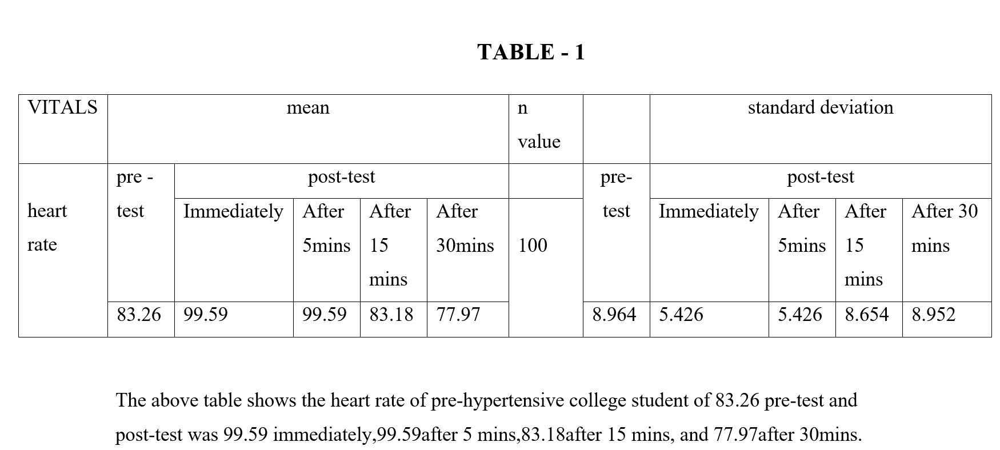
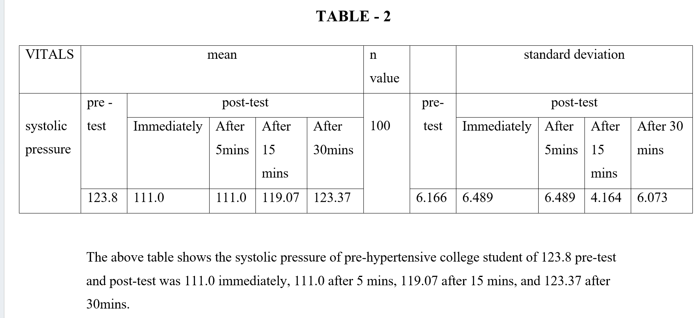
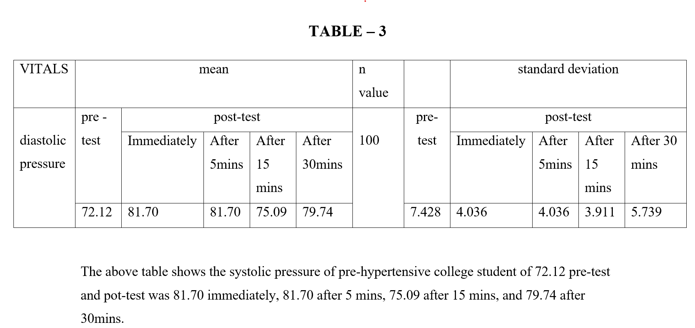
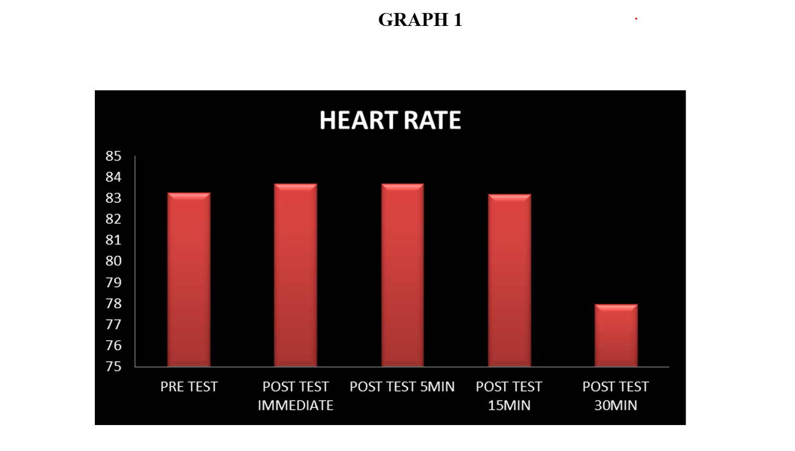
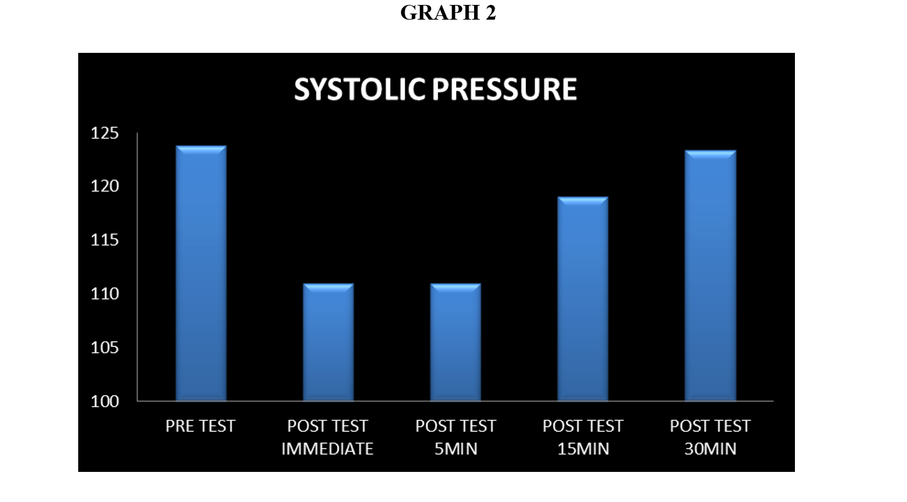
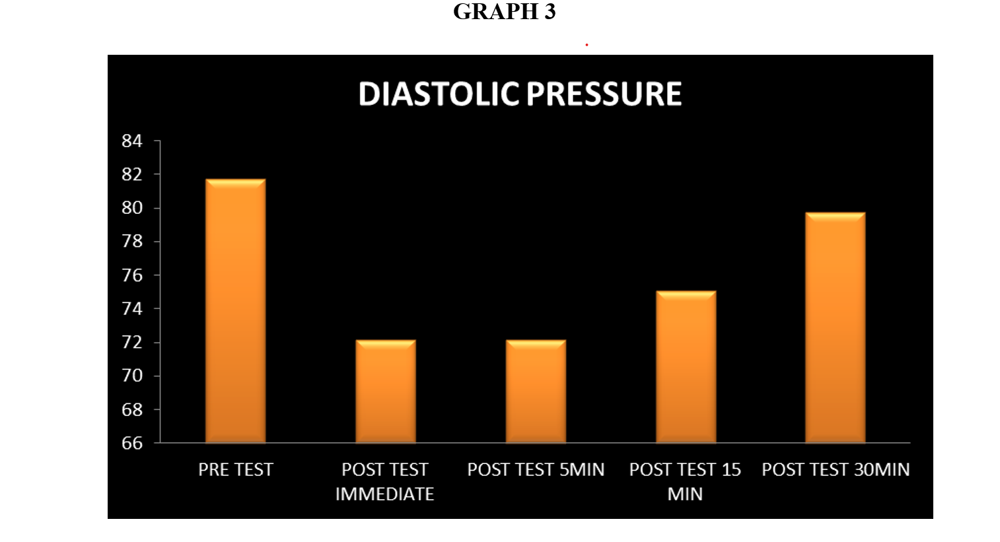

# Step Aerobics and Blood Pressure Analysis

## Project Description
This repository contains my first internship and academic research project completed in 2018 as part of my Bachelor of Physiotherapy program at SRM Institute of Science and Technology. The project analyzes the immediate effects of a single step-aerobics exercise session on heart rate, systolic blood pressure, and diastolic blood pressure among pre-hypertensive college students.

This project is presented in a data analysis format with tables, charts, and documented findings.

## Problem Statement
Pre-hypertension in young adults often goes undetected and can progress to hypertension if not managed early. This study evaluates whether a short-duration aerobic exercise session can produce immediate and measurable cardiovascular changes.

## Objectives
- To measure changes in heart rate after step aerobics exercise
- To evaluate immediate changes in systolic blood pressure
- To evaluate immediate changes in diastolic blood pressure
- To observe recovery trends over a 30-minute post-exercise period

## Study Design
- Study Type: Quasi-experimental (Pre-test and Post-test)
- Sample Size: 100 college students
- Age Group: 17–25 years
- Population: Pre-hypertensive male and female students
- Exercise Duration: 30 minutes (including warm-up and cool-down)
- Exercise Intensity: 60–75% of maximum heart rate

## Data Collection Method
Heart rate, systolic blood pressure, and diastolic blood pressure were measured using standard clinical instruments. Measurements were taken:
- Before exercise
- Immediately after exercise
- After 5 minutes
- After 15 minutes
- After 30 minutes

Data was manually recorded, tabulated in Microsoft Excel, and statistically analyzed using SPSS (ANOVA).

## Tools and Technologies
- Mercury sphygmomanometer
- Stethoscope
- 8-inch aerobic stepper
- Microsoft Excel
- IBM SPSS Statistics

## Key Findings
- Heart rate increased immediately after exercise and gradually returned to baseline within 30 minutes.
- Systolic blood pressure showed a significant immediate reduction following exercise and normalized within 30 minutes.
- Diastolic blood pressure followed a similar immediate reduction and recovery pattern.

## Results Summary
A single bout of step aerobics exercise demonstrated short-term cardiovascular benefits, supporting aerobic exercise as a non-pharmacological intervention for blood pressure control in pre-hypertensive young adults.

## Repository Structure
- report/ → Full internship project report (PDF)
- tables/ → Table images used in analysis
- charts/ → Graphs and visual trends
- docs/ → Supporting documentation (non-sensitive)

## Tables

### Heart Rate Table

### Systolic Blood Pressure Table

### Diastolic Blood Pressure Table

## Charts

### Heart Rate Trend

### Systolic Blood Pressure Trend

### Diastolic Blood Pressure Trend

## Skills Demonstrated
- Data collection and validation
- Descriptive statistics
- Time-based trend analysis
- Statistical testing (ANOVA)
- Healthcare data analysis
- Research documentation

## Author
Julia Reddy  
Bachelor of Physiotherapy – Internship Project  
SRM Institute of Science and Technology  
Year: 2018

## Disclaimer
This repository is intended for academic and portfolio demonstration purposes only. All participant data has been anonymized.
